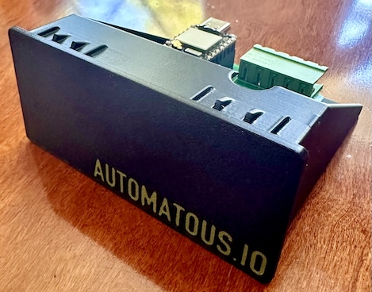
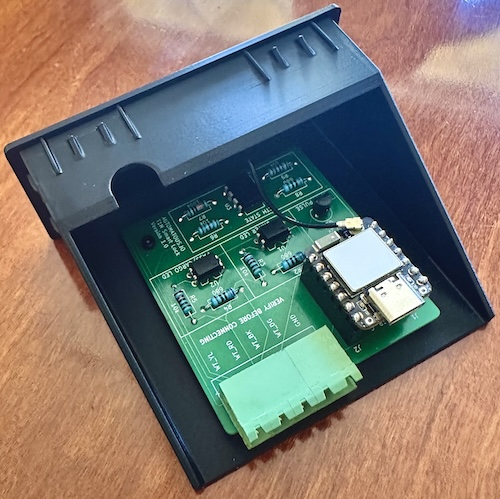

# Enclosure

**[README](../README.md)** > **Enclosure** · [Report an issue](../../../issues/new)

3D printable enclosure that houses the T1N Smart Lock PCB and drops
into the factory center console opening of the Sprinter T1N. For the board
it holds, see [HARDWARE.md](HARDWARE.md).

> Enclosure files are licensed under
> [CC BY 4.0](../enclosure/LICENSE.txt). See [LICENSING.md](LICENSING.md#hardware-and-enclosure)
> for what that allows.

  

## What this enclosure is

The enclosure is a single 3D printed part that the board drops into
from the top, with the XIAO's USB-C port and the J3 terminal both
accessible without removing the board after install. The entire back
is open to the inside of the center console, which doubles as ventilation (see
Thermal below).

The reference build prints in Polymaker PolyLite ASA with the "AUTOMATOUS.IO"
brand debossed on the front face and filled green.

## Enclosure specifications

| Property | Value |
|---|---|
| Outer dimensions | 89 × 41.5 × 75 mm (W × H × D) |
| Fits center console opening | ~89 × 41.5 mm (flush front face) |
| Material (reference build) | Polymaker PolyLite ASA |
| Revision | v1.0 |

## Files

- [`enclosure/t1n-smart-lock-enclosure.stl`](../enclosure/t1n-smart-lock-enclosure.stl) — ready to print
- [`enclosure/t1n-smart-lock-enclosure.step`](../enclosure/t1n-smart-lock-enclosure.step) — editable CAD source

Opening the STL on GitHub renders an interactive 3D preview in the
browser (rotate, pan, zoom), so you can inspect the part before
downloading or printing it. The STEP is the editable CAD source and
shows as text on GitHub rather than a 3D preview.

## Print settings

The reference build was printed with:

| Setting | Value |
|---|---|
| Printer | Bambu Lab H2D, 0.4 mm nozzle |
| Slicer profile | Bambu Studio "0.16mm Balanced Quality @BBL H2D" |
| Material | Polymaker PolyLite ASA |
| Layer height | 0.16 mm |
| Infill | 20%, gyroid |
| Supports | Not required |
| Bed orientation | Face down |

ASA warps if it cools unevenly, so print it in an enclosed chamber
and keep the print area free of drafts. A brim helps the corners
hold to the bed on a part this size. The reference build was printed
on an enclosed Bambu Lab H2D, which holds chamber temperature without
extra effort.

## Branding

The green "AUTOMATOUS.IO" on the front face is printed, not painted.
The text is debossed into the front face in the model, and the
reference build prints it as a second color on the H2D's dual nozzle:
black Polymaker PolyLite ASA for the body and Polymaker PolyLite ASA
Army Green for the recessed text, in one multicolor job
with the text faces assigned to the second nozzle. Reproducing the
look needs a dual-nozzle or AMS-capable printer. On a single-nozzle
printer, approximate it with a filament swap at the text layer or by
paint-filling the recess after printing.

## Assembly

  

The board drops into the enclosure from the top, oriented so the
XIAO (USB-C end) and the J3 terminal face the open rear. Seated
this way, both the USB-C port and the terminal stay accessible from
the back for wiring, power, and reflashing once the unit is installed.

1. **Seat the board.** Lower the PCB into the enclosure so it rests
   on the internal ledge, XIAO and J3 toward the open rear. The two
   mounting holes in the PCB line up with the screw bosses in the
   floor of the enclosure.
2. **Secure it.** Drive two M2 self-tapping hex socket cap screws
   (M2 × 5mm) through the PCB mounting holes into the bosses. The
   reference build used screws labeled `HNA-M2-5-H` (M2, 5mm, hex
   socket cap, self-tapping). Snug, don't overtighten; self-tapping
   screws cut their own thread in the printed boss and stripping it
   is easy with too much torque.

That completes the bench assembly. Wiring to J3, powering the XIAO,
and seating the enclosure into the center console are covered in
[INSTALL.md](INSTALL.md).

## Fit

The enclosure is a friction fit into the factory center console opening where the
factory storage pocket sits, with the front face flush to the center console and no
modification to the vehicle required.

Fit is verified on a 2005 Dodge Sprinter 2500. Other T1N years
(2002 to 2006) use a similar center console but are unconfirmed; verify the
opening before printing a final version. Seating the enclosure in the
center console, removal, and van side wiring are covered in
[INSTALL.md](INSTALL.md#seating-the-enclosure-in-the-center-console).

## Thermal

The board draws ~0.3W (see [HARDWARE.md](HARDWARE.md#power)), so heat is
minimal. The fully open back vents into the center console cavity, which is more
than sufficient for a sub-1W load.

## Related documentation

- [README](../README.md) — project overview and quick start
- [FIRMWARE.md](FIRMWARE.md) — firmware architecture and behavior
- [HARDWARE.md](HARDWARE.md) — PCB design, BOM, and ordering
- [BUILDING.md](BUILDING.md) — building and flashing the firmware
- [INSTALL.md](INSTALL.md) — commissioning and van installation
- [SAFETY.md](SAFETY.md) — electrical and operational safety
- [CERTIFICATION.md](CERTIFICATION.md) — Matter/Thread certification status
- [CONTRIBUTING.md](CONTRIBUTING.md) — how to contribute
- [LICENSING.md](LICENSING.md) — license terms