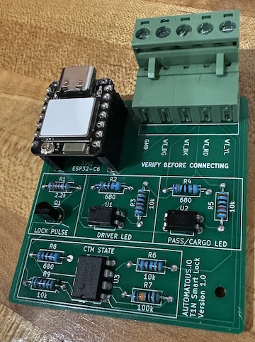
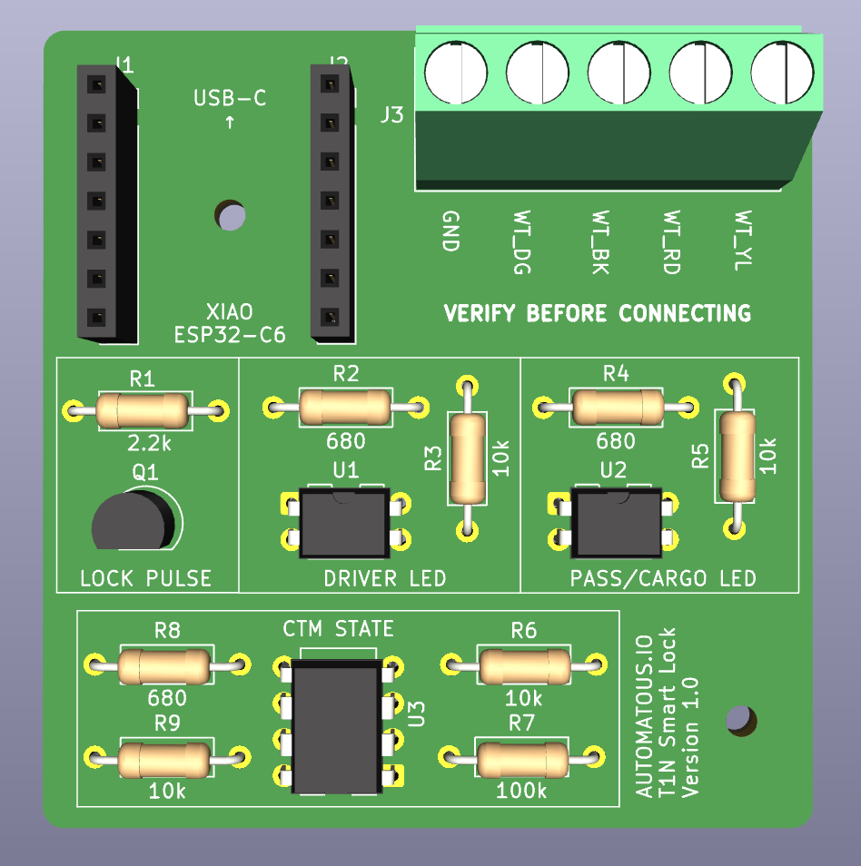
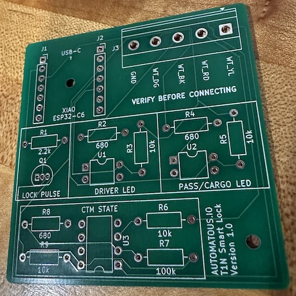

# Hardware

**[README](../README.md)** > **Hardware** · [Report an issue](../../../issues/new)

PCB design files, bill of materials, and ordering notes for the
T1N Smart Lock board. For the 3D printed enclosure that houses
this board, see [ENCLOSURE.md](ENCLOSURE.md). For what the
firmware running on it does, see [FIRMWARE.md](FIRMWARE.md).

> Hardware design files are licensed under
> [CC BY 4.0](../hardware/LICENSE.txt). See [LICENSING.md](LICENSING.md#hardware-and-enclosure)
> for what that allows.

<p align="center">
  <a href="media/t1n-smart-lock-assembled.jpeg">
    
  </a>
</p>

## What this board is

A small 2-layer carrier board for a Seeed Studio XIAO ESP32-C6.
The XIAO provides the Thread radio and runs the firmware; this
board adds the interface circuitry that lets the firmware observe
and command the Sprinter's factory central locking:

- A transistor output (Q1) that pulses the master lock line.
- Two optocouplers (U1, U2) that read the center console master door lock
  switch LEDs without electrically loading them.
- A comparator (U3) that turns the CTM's pulse-train sense line
  into clean digital edges for sleep detection.
- A 5-pin terminal block (J3) for the van-side wiring.

The XIAO is socketed on J1/J2, not soldered, so it can be swapped
or reflashed off-board. All components are through-hole and
hand-solderable. These are deliberate serviceability choices,
consistent across AUTOMATOUS.IO hardware and project designs.

## Board specifications

| Property | Value |
|---|---|
| Dimensions | 55.94 × 54 mm |
| Layers | 2 |
| Design tool | KiCad 10 |
| Controller | Seeed Studio XIAO ESP32-C6 (socketed) |
| Components | All through-hole, hand-solderable |
| Board revision | v1.0 |

## Schematic and layout

Design files live in `hardware/`:

- `hardware/kicad/`: KiCad 10 project (schematic + layout)
- `hardware/gerbers/`: fabrication outputs

[Schematic source (PNG)](../hardware/t1n-smart-lock-schematic.png) · [Schematic source (PDF)](../hardware/t1n-smart-lock-schematic.pdf)

## Power

> ⚠️ Connecting to vehicle 12V and the CTM carries real risks
> (miswiring, reverse polarity, CTM damage). Read
> [SAFETY.md](SAFETY.md) before wiring anything.

> The board draws ~0.3W continuously (~0.027A at 12V, measured at
> the buck input), since the Thread radio stays on. That is small
> enough to run from almost any 12V source. The reference build
> powers it from a 100Ah house/leisure battery. Whether a starter
> battery is also suitable depends on how often you drive; see
> [INSTALL.md](INSTALL.md#choosing-a-12v-source) for the tradeoff.

The board has no 12V input and no onboard 12V→5V stage. Power comes
in through the XIAO's USB-C connector, from an external buck
converter:

```
12V source  →  buck converter (12V → 5V, USB-C out)  →  XIAO USB-C
            →  XIAO onboard 5V→3V3 regulator  →  3V3 rail on this board
```

The 3V3 rail from the XIAO powers the optocoupler pull-ups and the
LM393. **12V never reaches this PCB.** J3 carries only the four van
signal wires plus ground; there is no power conductor on J3.

The buck converter is any quality automotive 12V→5V USB-C step-down.
Look for over-current and overvoltage protection; reverse-polarity
protection on the 12V input is also worth having, since a miswired
battery tap can otherwise damage the converter. It is external and
not part of this board's BOM.

## GPIO map

How the XIAO's pins connect to the board. This mirrors the pin
assignments in [FIRMWARE.md](FIRMWARE.md#hardware-interfaces).

| GPIO | Direction | Function | Circuit |
|---|---|---|---|
| 1 | Output | Master lock pulse | Drives Q1 base via R1 (2.2k) |
| 2 | Input | CTM sleep sense | LM393 (U3A) output, R9 pull-up |
| 18 | Input | Pass/cargo LED sense | PC817 (U2) collector, R5 pull-up |
| 20 | Input | Driver LED sense | PC817 (U1) collector, R3 pull-up |
| 3 | Output | RF switch enable | XIAO onboard antenna switch |
| 14 | Output | Antenna select (external U.FL) | XIAO onboard antenna switch |
| 15 | Output | Status LED | XIAO onboard LED |
| 9 | Input | Factory reset button | XIAO onboard BOOT button |

GPIO3, 14, 15, and 9 are internal to the XIAO module and do not
connect to this board's circuitry; they are listed for a complete
picture of pin usage.

## J3 terminal wiring

> ⚠️ Wiring errors can damage the CTM or board; see [SAFETY.md](SAFETY.md).

J3 is the only connection between the board and the van. The five
terminals, **in silkscreen order, left to right as printed on the board**,
are:

| Silkscreen | Signal | Connects to | Purpose |
|---|---|---|---|
| GND | Ground | Van chassis / CTM ground | Shared signal reference |
| WT_DG | Pass/cargo LED | Master door lock switch pass/cargo LED line | Read via U2 → GPIO18 |
| WT_BK | Driver LED | Master door lock switch driver LED line | Read via U1 → GPIO20 |
| WT_RD | CTM sense | CTM pulse-train line | Sleep detection via U3A → GPIO2 |
| WT_YL | Master lock | Master lock pulse line | Driven by Q1, pulsed from GPIO1 |

> The board silkscreen reads `GND · WT_DG · WT_BK · WT_RD · WT_YL`
> left to right. In the schematic, J3 pin 1 is `WT_YL` and pin 5 is
> `GND` (opposite order, since the connector is drawn from the other
> side). **Wire by the silkscreen, not the schematic pin numbers,**
> and confirm each signal before connecting. The board is printed
> `VERIFY BEFORE CONNECTING` for this reason. The `WT_*` labels are
> named for the factory wire colors they tap (Dodge base-with-tracer
> codes, so `WT_YL` is the white wire with a yellow tracer), but colors
> vary by year, market, and trim. Van-side wire colors, tap points, and
> the full wiring table are in [INSTALL.md](INSTALL.md#identifying-the-van-wires).

## Circuit blocks

**Master lock pulse (Q1).** GPIO1 drives the base of Q1 (PN2222A)
through R1 (2.2k). Q1's collector pulls the WT_YL master lock line
to ground for the pulse duration; the emitter is grounded. The
firmware drives GPIO1 low at init so the line is never floating
during boot (see `lock_pulse.cpp`). v1.0 has no base pull-down
resistor; float is handled in firmware.

**LED sense (U1, U2).** Each center console master-lock LED line drives
the input side of a PC817 optocoupler through a 680Ω series
resistor (R2 for driver/WT_BK, R4 for pass-cargo/WT_DG). The output
transistor pulls the GPIO low when the LED is lit, with R3 / R5
(10k) pulling the GPIO high otherwise. Optoisolation means the
board reads the LEDs without loading the van's wiring. U1 → GPIO20
(driver), U2 → GPIO18 (pass/cargo).

**CTM sleep detection (U3).** WT_RD carries a pulse train whose
frequency encodes whether the CTM is awake. R6 (10k) pulls WT_RD up
to the non-inverting input of comparator U3A (LM393). R7 (100k) and
R8 (680Ω) form a divider on the inverting input that sets the
comparison threshold. U3A's open-collector output drives GPIO2,
with R9 (10k) pulling the line up to 3V3, giving the firmware clean
digital edges to count. Only
half of the dual LM393 is used: U3A is active, U3B's inputs are
tied off, and U3C represents the shared power pins. Detail of the
firmware's edge-counting and sleep classifier is in
[FIRMWARE.md](FIRMWARE.md#what-the-firmware-observes).

## Bill of materials

### Board components

<p align="center">
  <a href="media/t1n-smart-lock-pcb.png">
    
  </a>
</p>

Soldered onto the PCB. All through-hole, hand-solderable.

| Ref | Qty | Type | Value | Footprint |
|---|---|---|---|---|
| J1, J2 | 2 | Socket header | 1×7, 2.54mm | PinSocket 1×07 P2.54mm vertical |
| J3 | 1 | Terminal block (see note) | 5.08mm, 5-pos | Phoenix MKDS-1,5-5-5.08 1×05 horizontal |
| Q1 | 1 | NPN transistor | PN2222A | TO-92 inline |
| R1 | 1 | Resistor | 2.2k | Axial DIN0207, P10.16mm |
| R2, R4, R8 | 3 | Resistor | 680Ω | Axial DIN0207, P10.16mm |
| R3, R5, R6, R9 | 4 | Resistor | 10k | Axial DIN0207, P10.16mm |
| R7 | 1 | Resistor | 100k | Axial DIN0207, P10.16mm |
| U1, U2 | 2 | Optocoupler | PC817 | DIP-4, W7.62mm |
| U3 | 1 | Dual comparator | LM393 | DIP-8, W7.62mm |

> **J3 terminal options.** The footprint is drawn for a fixed
> 5.08mm screw terminal (Phoenix MKDS). A 5.08mm *pluggable*
> terminal also fits the same pad pitch (with slight body overhang)
> and disconnects as a unit for easier service; the reference build
> uses this. Either works, pick your preference.

### External parts

Not soldered to the board; needed for a working install.

| Part | Notes |
|---|---|
| Seeed Studio XIAO ESP32-C6 | Seats into the J1/J2 sockets. Runs the firmware. |
| External antenna (U.FL / IPEX) | Connects to the XIAO's U.FL antenna connector. The firmware routes RF to the external antenna (see [FIRMWARE.md](FIRMWARE.md#module-map)), so this is required, not optional. |
| Buck converter, 12V→5V USB-C | Powers the XIAO from 12V source. Any quality automotive unit; see [Power](#power). |
| Inline fuse, ~1A | In the 12V feed close to the tap. Sized to the feed wire to protect the added wiring, not the board; see [INSTALL.md](INSTALL.md#powering-the-board). |

## Ordering the PCB

<p align="center">
  <a href="media/t1n-smart-lock-bare.jpeg">
    
  </a>
</p>

The board was fabricated at JLCPCB from the gerbers in
`hardware/gerbers/`. Reference order: 30 pcs, 2-layer, standard
spec. Any 2-layer fab that accepts standard gerbers will work.
The board is hand-assembled; JLCPCB assembly is not required
since all parts are through-hole.

## Related documentation

- [README](../README.md) — project overview and quick start
- [FIRMWARE.md](FIRMWARE.md) — firmware architecture and behavior
- [ENCLOSURE.md](ENCLOSURE.md) — 3D printed enclosure
- [BUILDING.md](BUILDING.md) — building and flashing the firmware
- [INSTALL.md](INSTALL.md) — commissioning and van installation
- [SAFETY.md](SAFETY.md) — electrical and operational safety
- [CERTIFICATION.md](CERTIFICATION.md) — Matter/Thread certification status
- [CONTRIBUTING.md](CONTRIBUTING.md) — how to contribute
- [LICENSING.md](LICENSING.md) — license terms