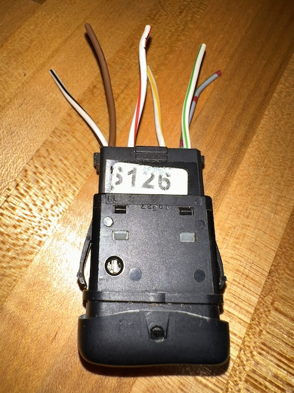
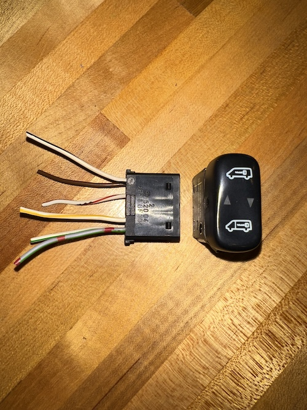
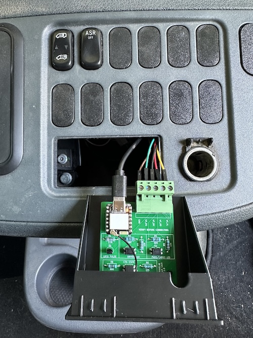
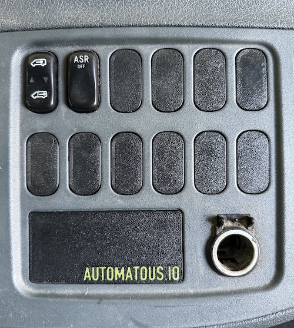
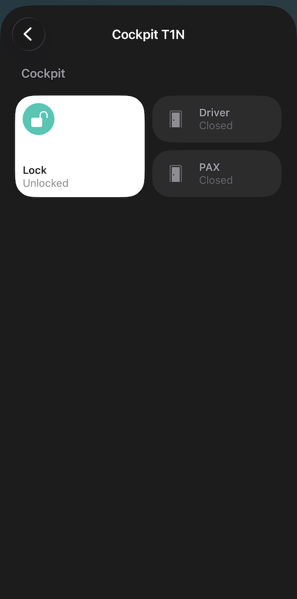
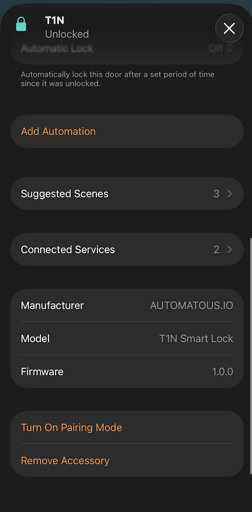
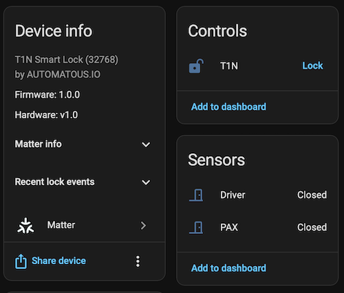

# Installation

**[README](../README.md)** > **Installation** · [Report an issue](../../../issues/new)

> **⚠️ Read [SAFETY.md](SAFETY.md) before you begin.** This install
> taps into your vehicle's wiring and the factory locking system.
> Wiring to the wrong conductor can damage the CTM, the board, or
> both. Wire colors and locations vary by year, market, and trim.
> Verify every wire in *your* van before connecting. You install
> this at your own risk.

This guide covers commissioning the assembled and flashed T1N Smart
Lock and fitting it into the van: pairing it to your Matter ecosystem
on the bench, choosing a power source, identifying and tapping the
factory wires, and seating the enclosure in the center console. For the board
see [HARDWARE.md](HARDWARE.md); for the enclosure see
[ENCLOSURE.md](ENCLOSURE.md); for building and flashing the firmware
see [BUILDING.md](BUILDING.md).

## Contents

- [Before you start](#before-you-start)
- [Commission the device](#commission-the-device)
- [Choosing a 12V source](#choosing-a-12v-source)
- [Identifying the van wires](#identifying-the-van-wires)
- [Connecting to the van wires](#connecting-to-the-van-wires)
- [Powering the board](#powering-the-board)
- [Seating the enclosure in the center console](#seating-the-enclosure-in-the-center-console)
- [Confirming it's connected](#confirming-its-connected)
- [Status LED reference](#status-led-reference)
- [Factory reset](#factory-reset)
- [Related documentation](#related-documentation)

## Before you start

This guide assumes you've already completed a couple of steps on the
bench:

- **Built or flashed the firmware and verified it runs.** See
  [BUILDING.md](BUILDING.md#flash-your-build).
- **Assembled the board into the enclosure.** See
  [ENCLOSURE.md](ENCLOSURE.md#assembly).

Commissioning comes next and is covered below. Do it on the bench
before wiring anything into the van.

Do not cut or tap any van wiring until the device is flashed,
commissioned, and confirmed working on the bench. A flash or
commissioning problem is trivial to fix on the bench. Once the unit
is installed it is still recoverable, the reference build uses a
quick-disconnect terminal and a USB-C plug so you can unwire it, but
you still have to pull the enclosure from the center console and
reflash, which is extra work you can avoid by getting it right first.

You'll also need:

- Connectors for the five signal and ground taps: five 3-conductor
  WAGO 221-series connectors for cut-and-splice (the reference build),
  or five T-taps for a reversible install (see [Connecting to the van
  wires](#connecting-to-the-van-wires)). Buy a few spares: the 12V feed
  (house battery or cigarette-lighter tap) and the inline fuse each
  need their own connectors too (see [Powering the
  board](#powering-the-board))
- A multimeter, basic hand tools (a screwdriver), and wire cutters
- Jumper wires for the board's five signal and ground leads.
  The reference build uses Dupont wires. These taps are low-power
  logic-level lines to the CTM, not the 12V supply, so thin jumper wire
  is adequate. The board takes its power over USB-C, where the buck and
  the XIAO step 5V down to 3V3; 12V never reaches these leads.
- A 12V→5V USB-C buck converter (see [HARDWARE.md](HARDWARE.md#power))
- A Thread Border Router reachable from the van (see
  [Confirming it's connected](#confirming-its-connected))

## Commission the device

Do this on the bench, with the board powered over USB-C, before you
wire anything into the van. Commissioning pairs the lock to your Matter
ecosystem and is stored on the device, so it carries over to the van
and you do not repeat it during the physical install.

Commissioning involves two roles, and people new to Matter over Thread
often conflate them because one device usually fills both. A Matter
controller is the ecosystem you pair the lock into and control it from:
Apple Home, Google Home, Amazon Alexa, or Home Assistant, running on a
phone or a home hub. A Thread Border Router is the radio bridge that
connects the lock's Thread network to your home IP network so the
controller can reach it. Both must be present and reachable on your
network during commissioning.

A single device can cover both needs. An iPhone 15 Pro or newer model
has its own Thread radio, so it can serve as the Matter controller and
reach the lock over Thread directly, with no separate Border Router or
hub. That is enough for local control while you are within Thread range
of the van. A stationary Border Router such as a HomePod mini, Apple TV 4K,
or Nest Hub 2nd gen keeps the Thread network reachable when your phone is away,
which adds remote control over the internet and supports automations. See
[SAFETY.md](SAFETY.md#what-this-device-requires-from-the-user) for the
local versus remote tradeoff.

BLE carries only the pairing handshake; the lock operates over Thread
once it has joined.

The pairing QR code and manual pairing code are saved at
[`media/matter_qrcode.png`](media/matter_qrcode.png) for convenience.
Every build of this firmware shares the same test credentials and
therefore the same code, so it is not a secret (see
[CERTIFICATION.md](CERTIFICATION.md)).

1. Power the board over USB-C and confirm the status LED is blinking
   rapidly (uncommissioned, see
   [Status LED reference](#status-led-reference)).
2. In your Matter app, add a device and scan the QR code or enter the
   manual pairing code.
3. This firmware ships with test attestation certificates, so the app
   warns that the accessory is uncertified. Accept it ("Add Anyway" in
   Apple Home). This is expected for a self-built device; see
   [CERTIFICATION.md](CERTIFICATION.md#what-this-means-for-users).
4. Wait for the device to join Thread. The LED moves from rapid blink
   to a slow blink while attaching, then goes solid once it is
   connected and operational.

On the bench the device accepts lock and unlock commands but cannot
observe the van's LEDs yet, so reported lock state is not meaningful
until it is wired in. Confirm it pairs and responds, then move on to
the wiring.

Matter is multi-admin, so you can add the lock to more ecosystems later
without starting over: from the app that already controls it, open a
new pairing window (the "add another app" or share option) to get a
fresh setup code, then commission from the second app. You do not
factory reset to add an ecosystem; a reset wipes every commissioned
fabric (see [Factory reset](#factory-reset)).

## Choosing a 12V source

The board draws ~0.3W continuously (~0.027A at 12V), since the
Thread radio stays on. This is a small but constant 24/7 load on
whatever 12V source feeds the buck converter, whether or not the van
is running.

**Recommended: house / leisure battery.** The reference build feeds
the buck from a 100Ah house battery. At 0.027A the draw is
negligible against that capacity and keeps the
lock available with zero impact on your ability to start the van.

**Starter battery: fine if you drive periodically.** The draw is
small enough that a starter battery tolerates it for weeks, not
hours, so this is reasonable if the van is driven every week or two.
The case to avoid is a van that sits unused for many weeks, or a
starter battery already aging or weak. If that's your situation, use
the house battery or add a low-voltage cutoff.

If in doubt, use the house battery.

## Identifying the van wires

> **⚠️ Confirm every wire in your own van.** The colors and
> locations below are from a 2005 Dodge Sprinter 2500. Other years,
> markets, and trims differ. Verify each wire's function with a
> multimeter before tapping it. A wrong tap can damage the CTM. See
> [SAFETY.md](SAFETY.md).

Each J3 terminal connects to one factory wire. The J3 signal names
and the board side are in [HARDWARE.md](HARDWARE.md#j3-terminal-wiring); this is the
van side.

| J3 signal | Function | Factory wire (2005 Dodge) | Location |
|---|---|---|---|
| GND | Ground | Chassis / CTM ground | Back of the MLS |
| WT_DG | Pass/cargo LED | White, dark green tracer | Back of the MLS |
| WT_BK | Driver LED | White, black tracer | Back of the MLS |
| WT_RD | CTM sleep sense | White, red tracer | Back of the MLS |
| WT_YL | Master lock pulse | White, yellow tracer | Back of the MLS |

The J3 terminals are named for these factory wire colors, in the
Dodge base-with-tracer convention (WT/YL, WT/RD, WT/BK, WT/DG). The
colors above are the reference build's 2005 Sprinter wiring. Confirm
each one with a multimeter before connecting, as the warning above
stresses.

All five connections are made at the back of the master door lock switch
(MLS), the lock-button cluster in the center console. The four signal wires and
ground all exit the MLS connector, so this one spot is the only place
you tap. Remove the MLS from the center console to reach the connector behind it,
identify each wire by the colors in the table above (metering to
confirm), then splice or T-tap there as described in [Connecting to the
van wires](#connecting-to-the-van-wires).

<p align="center">
  <a href="media/t1n-smart-lock-mls.jpeg">
    
  </a>
  <a href="media/t1n-smart-lock-mls-harness-disconnected.jpeg">
    
  </a>
</p>

The factory service manual is useful for cross-referencing wire
functions and connector pinouts. It is copyrighted, so it is not
included in this repository. A copy of the 2006 Sprinter service
manual is hosted at
[diysprinter.co.uk](https://diysprinter.co.uk/reference/2006-VA-SM.pdf),
with more reference documents in their [reference
index](https://diysprinter.co.uk/reference/). The 2006 manual is
close enough to the 2005 reference build for wiring cross-reference,
but confirm every wire in your own van with a multimeter regardless.

## Connecting to the van wires

Each signal wire plus ground needs a tap into the corresponding
factory wire. Two approaches, depending on whether you want the
install to be reversible:

**Cut-and-splice (reference build).** Cut the factory wire and join
both ends plus the board's lead with a 3-conductor lever connector
(the reference build used a WAGO 221-series connector).
Solid and vibration-resistant. The tradeoff is permanence: the
factory wire is cut, so fully removing the install later means
rejoining it.

**T-tap / Posi-Tap (reversible).** Clamp a tap onto the factory wire
without cutting it, leaving the OEM harness intact so the install
can be removed later with no trace. The tradeoff is a less robust
connection; use quality taps and check them.

The reference build used cut-and-splice with WAGOs. If keeping the
van's wiring fully reversible matters to you, use quality tap
connectors instead.

## Powering the board

```
12V source  →  buck converter (12V → 5V, USB-C out)  →  XIAO USB-C
```

Run the buck's input from your chosen 12V source (see
[Choosing a 12V source](#choosing-a-12v-source)) and its USB-C
output into the XIAO's USB-C port, reachable through the open rear
of the enclosure. The XIAO regulates 5V down to the 3V3 that powers the
board; 12V never reaches the PCB. See [HARDWARE.md](HARDWARE.md#power) for
the full power path and buck selection.

How 12V reaches the buck depends on the source you chose above:

- **House / leisure battery.** Mount the battery wherever it lives in
  the build and run a 12V feed forward to the buck under the center console.
- **Starter battery.** The easiest tap is the always-on 12V accessory
  (cigarette-lighter) socket, which sits in the same center console area as the
  master door lock switch. Splice or T-tap its constant-hot lead the same
  way you tapped the signal wires, after confirming it is constant
  power and not ignition-switched.

Mount the buck behind or under the center console near the enclosure so its
USB-C output is a short run into the XIAO through the open rear. Put a
small inline fuse (on the order of 1A, sized to the feed wire) in the
12V feed between the tap and the buck input, as close to the tap as
practical; the board's draw is tiny, so the fuse is there to protect
the added wiring, not the board.

## Seating the enclosure in the center console

<p align="center">
  <a href="media/t1n-smart-lock-enclosure-dash-seat-install-wired.jpeg">
    
  </a>
  <a href="media/t1n-smart-lock-enclosure-dash-install.jpeg">
    
  </a>
</p>

With the wiring connected and routed behind it, push the enclosure into
the factory center console opening where the factory storage pocket sat until the
front face is flush. It's a friction fit; no fasteners or modification
required.

To remove it later, hook a fingertip over the top edge and pull the
enclosure toward you; it lifts out of the friction fit.

## Confirming it's connected

The device was already commissioned on the bench (see
[Commission the device](#commission-the-device)), and commissioning is
stored on the device, so there's nothing to re-pair. Once powered in the van, it
rejoins your Thread network automatically. The status LED goes solid
when it's attached and operational (see
[Status LED reference](#status-led-reference)).

Open your Matter app and confirm the lock now reflects the van: with
the doors closed, locking and unlocking from the app should drive
the factory locks, and the lock/door state should track reality.
This is the first point at which lock state reads correctly, on the
bench the device responded but couldn't observe the van's LEDs.

Do this with the CTM awake. The firmware reads factory state through
the center console LEDs, and those are only lit while the CTM is
awake. Using the van, such as opening a door, wakes it; if the van has
sat undisturbed long enough for the CTM to sleep, the LEDs go dark and
the reported state freezes at its last known value until something
wakes it (see [Failure modes](SAFETY.md#failure-modes)). Right after
wiring and seating the enclosure the CTM is usually awake from your
activity, so confirm state then.

If the device does *not* appear or won't reconnect (for example, you
factory-reset it, or it was never commissioned), re-commission it:
with the device powered, add it in your Matter app using the QR code
/ setup code (same "Add Anyway" prompt as during bench commissioning,
see [Commission the device](#commission-the-device) and
[CERTIFICATION.md](CERTIFICATION.md#what-this-means-for-users)).

The device presents three things in your Matter app: a door lock and
two contact sensors, one for the driver side and one for the passenger,
cargo, and rear doors. The lock responds to Lock and Unlock; each contact
sensor reports its side as open or closed, following the factory door
state the firmware observes.

How these are grouped and named depends on the ecosystem. Apple Home
shows them under a single accessory that you can separate into a lock
and two sensors and rename (for example "T1N", "Driver", and "PAX").
Home Assistant's Matter integration exposes the lock as a `lock` entity
and each door contact sensor as a `binary_sensor`. The exact entity
names and `device_class` depend on the Home Assistant and Matter
integration version. The default names are auto-generated and differ by
app and version, so rename them to something meaningful after pairing.

<p align="center">
  <a href="media/t1n-smart-lock-home-with-doors.png">
    
  </a>
  <a href="media/t1n-smart-lock-home-firmware.png">
    
  </a>
  <a href="media/t1n-smart-lock-ha.png">
    
  </a>
</p>

## Status LED reference

The onboard status LED (on the XIAO) shows commissioning and network
state:

| LED pattern | Timing | Meaning |
|---|---|---|
| Rapid blink | 200ms on / 200ms off | Uncommissioned, advertising over BLE for pairing |
| Slow blink | 500ms on / 1500ms off | Commissioned, attaching to the Thread network |
| Solid on | Continuous | Connected to Thread, operational |
| Identify blink | 100ms on / 900ms off | Matter Identify command active |

Solid on is the healthy resting state.

## Factory reset

To wipe the device's Matter commissioning and reopen the pairing
window, **hold the BOOT button on the XIAO for 10 seconds.** The
device clears its commissioned state, reboots, and returns to BLE
advertising so it can be re-commissioned.

The BOOT button is not reachable with the enclosure seated in the
center console. Pull the enclosure out first (hook a fingertip over the top edge
and lift it from the friction fit, as in [Seating the enclosure in the
center console](#seating-the-enclosure-in-the-center-console)), hold BOOT for 10 seconds,
then reseat it.

You do not need a factory reset to add the lock to another ecosystem;
Matter is multi-admin (see
[Commission the device](#commission-the-device)). Use a reset to return
the device to a clean, uncommissioned state, for example before handing
it to someone else or when commissioning is broken. To re-flash the
firmware entirely (not just reset commissioning), see
[BUILDING.md](BUILDING.md#flash-your-build).

## Related documentation

- [README](../README.md) — project overview and quick start
- [FIRMWARE.md](FIRMWARE.md) — firmware architecture and behavior
- [HARDWARE.md](HARDWARE.md) — PCB design, BOM, and ordering
- [ENCLOSURE.md](ENCLOSURE.md) — 3D printed enclosure
- [BUILDING.md](BUILDING.md) — building and flashing the firmware
- [SAFETY.md](SAFETY.md) — electrical and operational safety
- [CERTIFICATION.md](CERTIFICATION.md) — Matter/Thread certification status
- [CONTRIBUTING.md](CONTRIBUTING.md) — how to contribute
- [LICENSING.md](LICENSING.md) — license terms